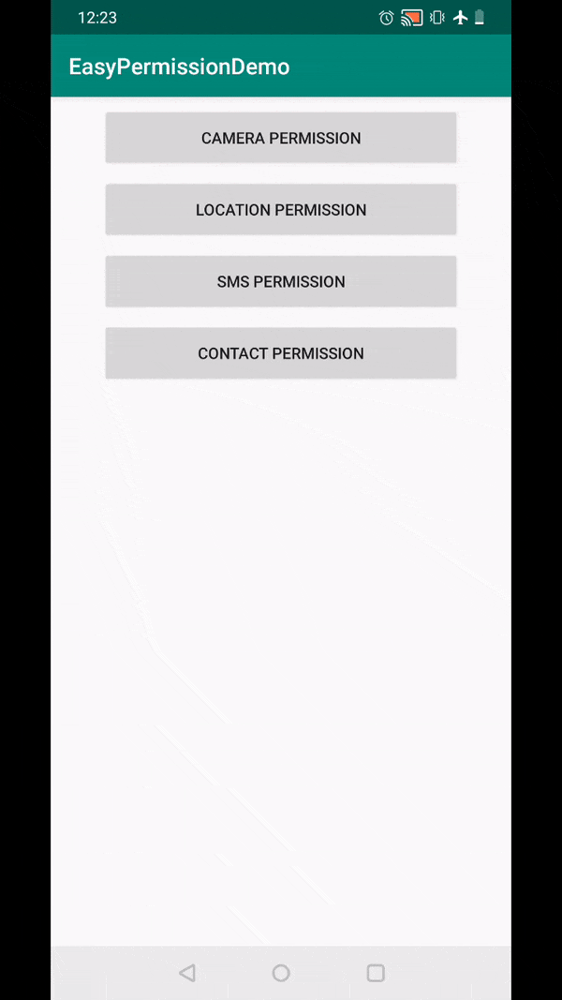

# EasyPermissionsDemo**

A sample app demonstrating handling runtime permission in android marshmallow and above devices using Google's EasyPermissions library.

### Handling runtime permission in Marshmallow and above devices.
Dangerous permission cannot be directly granted by just mentioning it in Android Manifest, it has to be explicitly asked during runtime and user has to grant the permission.

Handling runtime permission is a rudimentary task for any app. [Ask for permission, if denied show rationale dialog explaining why we need permission, if denied with never ask again, show a dialog asking user to grant permission from app settings screen, when returned from setting screen again check if the permission was given or no and so on....]

There are many libraries which provide wrapper over handling runtime permission. The top ones are

Dexter - https://github.com/Karumi/Dexter
EasyPermissions by google - https://github.com/googlesamples/easypermissions
EasyPermissions has more stars and larger community than Dexter. And also since it is developed by Google it is reliable.

Flow in asking dangerous permission.

There are multiple flows that different app follows in asking these permissions

Few apps, show alert dialog first, explaining why they need permission and then request for permission.

Few apps directly ask for permission, if denied they show a dialog explaining why they need permission and request again.

Few apps allow users to enter app, but show a blank screen with button asking permission. In this case users are allowed to use rest of the app features, features which doesn't need this permission. (Ex - Lark Player)

It depends on the app's use case on which flow to use.

EasyPermissions handles all the scenarios of runtime permissions. Showing rationale dialog - a message explaining why the application needs this set of permissions will be displayed if the user rejects the request the first time. Redirecting the user to App settings screen to grant permission if user clicked denied and never ask again.

### Reference Links

EasyPermssions Library - https://github.com/googlesamples/easypermissions
Mindorks Blog - https://blog.mindorks.com/implementing-easy-permissions-in-android-android-tutorial

